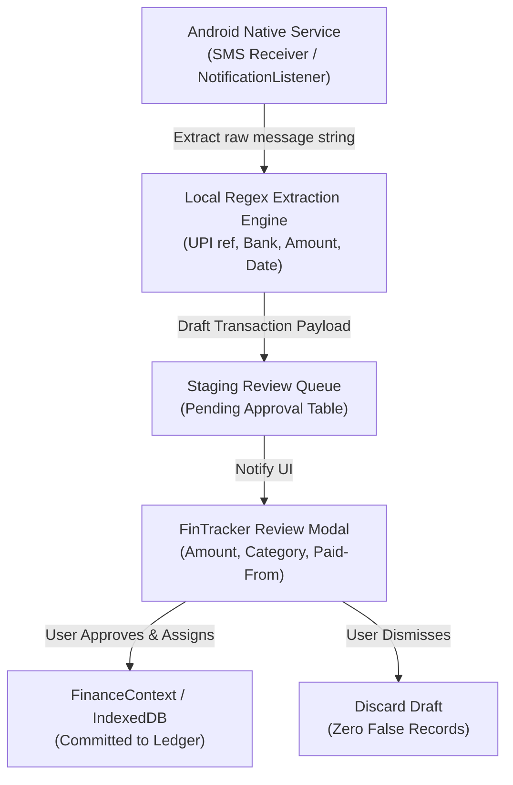

# FinTracker — Version 1.0.0

> **Premium Local-First Personal Finance Management PWA**  
> *Track expenses, income, and external family money with Indian Rupee (₹) precision, zero cloud dependencies, and full offline capability.*

---

## 1. Project Overview

**FinTracker** is an installable, mobile-first progressive web application (PWA) designed to provide individuals, students, and professionals with total command over their daily finances.

Unlike generic spreadsheets or cloud-dependent finance trackers, FinTracker operates on a **local-first architecture**:
* All data resides securely on the user's device using **IndexedDB**.
* No external backend, telemetry, or server login is required for V1.
* Works seamlessly **offline** and can be installed directly from modern browsers to iOS and Android home screens.
* Deployed as a static SPA on **GitHub Pages** with automated GitHub Actions CI/CD.

---

## 2. Key Features

### 💎 Dashboard & Overview
* **Total Available Balance**: Instantly displays your current liquid financial standing (Regular Income + External Received Money − Total Expenses).
* **Monthly Summary Card**: Switch between any month (current, previous, or custom) to view Monthly Income, Expenses, Net Savings, and Transaction Count.
* **Spending Category Breakdown**: Visual progress bars ranking top spending categories for the active month.
* **Other Money Summary Widget**: Compact preview showing Total Received, Used, and Remaining for family funds.
* **Recent Transactions**: Quick access to recent activity with category icons, date/time, and a "View All" link.

### ⚡ Fast Transaction System
* **Instant Entry Modal**: Accessible via the prominent central **+** button on mobile or desktop header.
* **Large Amount Input**: Prominent keypad-ready numeric field with ₹ currency indicator.
* **Expense vs. Income Switch**: Quick pill toggle with tactile color indicators.
* **Category Picker**: Categorized grid with customized icons and color badges.
* **Paid From (Source Linking)**: Option to link an expense to an "Other Money" source (e.g. *Dad's Money*) to deduct directly from that pool.
* **Payment Methods**: Cash, UPI, Card, Bank, and Other.
* **Daily Grouping**: Transactions are organized by day ("Today", "Yesterday", "Sep 16, 2026") with day-by-day expenditure totals.
* **Details & Editing**: Tap any transaction to view timestamps, edit fields, or safely delete with confirmation.

### 👨‍👩‍👧 Dedicated "Other Money" System
Designed for funds received from parents, family, stipends, or scholarships that need isolated tracking:
* **Custom Sources**: Pre-seeded with *Dad's Money*, *Mom's Money*, *Scholarship*, and *Freelance*, plus the ability to create new custom sources.
* **Fund Formula**: `Total Received − Money Used = Remaining Balance`.
* **Deposit History**: Record individual deposits with timestamps and notes (e.g. "Monthly money ₹3,000", "Exam fee support ₹2,000").
* **Expense Tracking**: View all expenses linked to each specific source.
* **Source Editing & Deletion Safeguards**: Protects sources while preserving transaction data.

### 📊 Reports & Actionable Insights
* **Flexible Timeframes**: Analyze by *This Month*, *Last Month*, *Last 3 Months*, *This Year*, or *All Time*.
* **Key Metric Highlights**: Total Income, Total Expenses, Net Savings Rate (%), Highest Spending Category, and Average Daily Spend.
* **Monthly Trend Chart**: Responsive SVG dual-bar chart visualizing income vs. expense progression over recent months.
* **Category Spending Table**: Complete percentage distribution with color-coded progress bars.

### 🏷️ Category Management
* **Comprehensive Default Set**: Over 25 standard categories across Food, Travel, Personal, Bills, Income, and Other.
* **Custom Categories**: Add custom categories with custom Lucide icons and vibrant color accents.
* **Protective Migration**: Deleting a category with existing transactions prompts the user to migrate those transactions to another category, preventing orphaned records.

### 🛡️ Defensive Data Import & Export
* **JSON Full Backup**: Exports the entire database (transactions, categories, sources, receipts, settings) into a single timestamped JSON file (`FinTracker_Backup_YYYY-MM-DD.json`).
* **CSV Export**: Clean, spreadsheet-friendly export compatible with Excel, Google Sheets, and LibreOffice with sanitization against formula injection (`=`, `@`, `+`, `-`).
* **Defensive Import Validator**:
  * Reads JSON backups or CSV files.
  * Validates required columns, positive amounts, dates, and categories.
  * Detects potential duplicates against existing records.
  * Displays an interactive **Preview Modal** with record counts and issue summaries before committing changes.
  * Offers **Merge Data** or **Replace Everything** import modes.

### 📱 Installable PWA & Update Engine
* **Web App Manifest**: Configured for standalone display mode, orientation lock, and dark/light theme integration.
* **Offline Caching**: Service worker precaches all application assets and icons.
* **In-App Version Update Alert**: When a new version is deployed to GitHub Pages, a polite slide-up notification offers **"Update Now"** (activates new worker and reloads without interrupting active forms) or **"Later"**.
* **PWA Install Banner**: Displays an "Install FinTracker" banner when viewed in compatible mobile browsers.

### 🌓 Themes & Accessibility
* **Dark, Light, and System Modes**: Seamless toggle with high-contrast surfaces, readable text, and persistent preferences.
* **Responsive Layout**: Mobile bottom navigation bar with elevated floating **+** button; desktop sidebar layout for larger screens.

---

## 3. Technologies Used

| Layer | Technology | Purpose |
| :--- | :--- | :--- |
| **Framework** | [React 18](https://react.dev/) + [TypeScript](https://www.typescriptlang.org/) | Type-safe UI components and state management |
| **Build Tool** | [Vite 5](https://vitejs.dev/) | Sub-second HMR and optimized production bundling |
| **Styling** | [Tailwind CSS 3](https://tailwindcss.com/) | Utility-first styling with custom fintech color palette and dark mode |
| **Icons** | [Lucide React](https://lucide.dev/) | Clean, consistent icons for categories and UI |
| **Routing** | [React Router 6](https://reactrouter.com/) (`HashRouter`) | Zero-404 routing across GitHub Pages subpaths and offline environments |
| **Local Database** | [IndexedDB](https://developer.mozilla.org/en-US/docs/Web/API/IndexedDB_API) via [`idb`](https://github.com/jakearchibald/idb) | Transactional, structured local-first persistence |
| **PWA & SW** | [`vite-plugin-pwa`](https://vite-pwa-org.netlify.app/) (Workbox) | Offline precaching, service worker generation, and update detection |
| **Native Shell** | [Capacitor 8](https://capacitorjs.com/) (`@capacitor/android`, `@capacitor/app`, etc.) | Android runtime shell, back button handling, status bar, and splash screen |
| **CI/CD** | GitHub Actions | Automated build and deployment to GitHub Pages |

---

## 4. Project Structure

```text
FinTracker/
├── .github/
│   └── workflows/
│       └── deploy.yml              # Automated GitHub Pages CI/CD workflow
├── android/                        # Capacitor native Android project
│   ├── app/
│   │   ├── src/main/
│   │   │   ├── AndroidManifest.xml # Zero-privilege manifest (INTERNET only)
│   │   │   ├── java/com/fintracker/app/MainActivity.java
│   │   │   └── res/                # Branded ₹ adaptive launcher icons & splash screens
│   │   └── build.gradle
│   ├── gradle/
│   └── build.gradle
├── public/
│   ├── favicon.svg                 # Indian Rupee vector favicon
│   ├── pwa-192x192.png             # PWA app icon (192x192)
│   ├── pwa-512x512.png             # PWA app icon (512x512)
│   └── pwa-512x512-maskable.png    # Maskable PWA app icon
├── scripts/
│   └── postbuild.js                # Generates dist/404.html for GitHub Pages SPA
├── tests/
│   └── test-logic.js               # Node.js unit tests for calculations & formatting
├── src/
│   ├── assets/                     # SVG logos and brand assets
│   ├── components/
│   │   ├── common/                 # Button, Modal, Card, Badge, EmptyState, ConfirmDialog
│   │   ├── dashboard/              # BalanceCard, MonthlySummary, SpendingOverview, RecentTransactions, OtherMoneyWidget
│   │   ├── layout/                 # AppLayout, Header, BottomNav, DesktopSidebar
│   │   ├── otherMoney/             # AddMoneyReceiptModal, AddMoneySourceModal, SourceDetailModal
│   │   ├── pwa/                    # UpdateNotificationPrompt, InstallPwaBanner
│   │   ├── settings/               # DataImportModal
│   │   └── transactions/           # TransactionFormModal, TransactionDetailModal, TransactionItem
│   ├── config/
│   │   ├── defaultCategories.ts    # 25+ default categories & initial money sources
│   │   └── version.ts              # Centralized versioning (v1.0.0) and changelog
│   ├── context/
│   │   ├── FinanceContext.tsx       # Global finance state & IndexedDB synchronization
│   │   ├── ThemeContext.tsx         # Dark / Light / System theme manager
│   │   └── ToastContext.tsx         # In-app toast alerts
│   ├── db/
│   │   ├── index.ts                # Repositories (Transaction, Category, Source, Receipt, Settings)
│   │   └── schema.ts               # IDB schema v1 definition
│   ├── hooks/
│   │   ├── useNativeApp.ts          # Android hardware back button, status bar & keyboard bridge
│   │   └── usePwaUpdate.ts          # Service worker update detection hook
│   ├── pages/
│   │   ├── CategoriesPage.tsx      # Custom category manager with migration safeguards
│   │   ├── DashboardPage.tsx       # Primary financial dashboard
│   │   ├── MorePage.tsx            # Mobile navigation hub
│   │   ├── OtherMoneyPage.tsx      # Family/scholarship money tracker
│   │   ├── ReportsPage.tsx         # Analytics and visual trend reports
│   │   ├── SettingsPage.tsx        # Preferences, backups, and app info
│   │   └── TransactionsPage.tsx    # Transaction history with search & filters
│   ├── services/
│   │   ├── exportService.ts        # JSON backup & CSV spreadsheet generation
│   │   ├── importService.ts        # Defensive JSON/CSV parser and duplicate detector
│   │   └── native/                 # Platform detection & future native detection interface
│   ├── types/
│   │   ├── category.ts
│   │   ├── otherMoney.ts
│   │   ├── settings.ts
│   │   └── transaction.ts
│   ├── utils/
│   │   ├── cn.ts                   # Tailwind class merge helper
│   │   ├── currency.ts             # Indian Rupee (₹) formatting with Lakhs/Crores
│   │   ├── dates.ts                # Date formatting and grouping helpers
│   │   └── sanitize.ts             # CSV and text sanitization
│   ├── App.tsx                     # Top-level routing & context providers
│   ├── index.css                   # Tailwind styles and mobile safe-area insets
│   └── main.tsx                    # React mounting entry point
├── capacitor.config.ts             # Capacitor configuration (appId: com.fintracker.app)
├── index.html                      # HTML root with PWA meta tags
├── package.json
├── postcss.config.js
├── tailwind.config.js
├── tsconfig.json
└── vite.config.ts                  # Vite + PWA + Rollup manualChunks config
```

---

## 5. How to Run Locally

### Prerequisites
* **Node.js**: `v18+` (Tested on `v22.14.0`)
* **npm**: `v9+` (Tested on `10.9.2`)

### Steps
1. Clone or open the repository:
   ```bash
   cd FinTracker
   ```
2. Install dependencies:
   ```bash
   npm install
   ```
3. Start the local development server:
   ```bash
   npm run dev
   ```
4. Open the displayed URL in your browser:
   ```text
   http://localhost:5173/
   ```

### Running Unit Tests
To verify all calculation logic, formatting, and sanitization:
```bash
npm test
```
*(Runs `node --test tests/test-logic.js`)*

---

## 6. How to Build Production Version

To produce the optimized static bundle:
```bash
npm run build
```

This will:
1. Run `tsc -b` for strict type checking.
2. Build minified JavaScript and CSS assets into `dist/`.
3. Split vendor chunks (`vendor-react`, `vendor-idb`).
4. Generate `dist/sw.js` and precached Workbox assets for PWA offline operation.
5. Execute `scripts/postbuild.js` to create `dist/404.html` for GitHub Pages.

To preview the built production site locally:
```bash
npm run preview
```

---

## 7. How to Deploy to GitHub Pages

FinTracker includes a preconfigured GitHub Actions workflow in [`.github/workflows/deploy.yml`](.github/workflows/deploy.yml).

### Step-by-Step Setup:
1. **Initialize Git Repository** (if not already done):
   ```bash
   git init
   git add .
   git commit -m "Initial release of FinTracker V1"
   ```
2. **Create a GitHub Repository**:
   * Create a new repository on GitHub named `FinTracker` (or your preferred name).
3. **Push to GitHub**:
   ```bash
   git remote add origin https://github.com/<your-username>/FinTracker.git
   git branch -M main
   git push -u origin main
   ```
4. **Enable GitHub Pages**:
   * Go to your repository on GitHub: **Settings** > **Pages**.
   * Under **Build and deployment** > **Source**, select **GitHub Actions**.
5. **Automatic Deployment**:
   * Pushing to `main` will automatically trigger the workflow in `.github/workflows/deploy.yml`.
   * The workflow builds the project with `VITE_BASE_PATH: './'` and publishes `dist/` directly to GitHub Pages.
6. **Accessing the App**:
   * Once the action completes (typically 1–2 minutes), your PWA will be live at:
     ```text
     https://<your-username>.github.io/FinTracker/
     ```

---

## 8. How to Install the PWA on Mobile Devices (Web Version)

### On Android (Chrome / Edge / Brave / Firefox)
1. Open the deployed application URL in Chrome: `https://harshithsai571.github.io/FinTracker/`.
2. A prompt **"Install FinTracker PWA"** will appear automatically at the top of the screen. Tap **Install**.
3. If not shown, tap the browser's **three dots (⋮)** menu and select **"Add to Home screen"** or **"Install App"**.
4. FinTracker will appear on your home screen and app drawer with the native ₹ logo and launch in standalone full-screen mode.

### On iOS (Safari)
1. Open the deployed application URL in Safari: `https://harshithsai571.github.io/FinTracker/`.
2. Tap the **Share button** (square with an upward arrow) at the bottom toolbar.
3. Scroll down and tap **"Add to Home Screen"**.
4. Confirm the name **FinTracker** and tap **Add**.
5. FinTracker will launch without Safari URL bars and function offline.

---

## 9. Download FinTracker for Android

FinTracker is available as a native Android application package (`.apk`) distributed through official GitHub Releases.

* 📥 **[Download Latest Android Release APK](https://github.com/harshithsai571/FinTracker/releases/latest)**
* 🗄️ **[Browse All Previous Releases & Changelogs](https://github.com/harshithsai571/FinTracker/releases)**

> [!NOTE]
> Release APK binaries are attached directly as downloadable assets on GitHub Releases and are **never committed into the Git source repository**.

---

## 10. Installing the Android APK

1. **Download**: Download the latest release APK (e.g. `FinTracker-v1.0.0.apk`) from the [Latest Release page](https://github.com/harshithsai571/FinTracker/releases/latest) on your Android device.
2. **Open APK**: Tap the download completion notification or navigate to your **Downloads** folder in the Files app.
3. **Allow Installation**: If prompted, allow your browser or file manager to **Install unknown apps** (*Settings > Apps > Special app access > Install unknown apps*).
4. **Confirm Install / Update**: Tap **Install** (or **Update** if upgrading an existing version).
5. **Data Safety**: Upgrading FinTracker over an existing installation **100% preserves your IndexedDB financial records, transactions, and categories intact**.

---

## 11. Updating FinTracker

FinTracker features a dual-track, zero-confusion update distribution system:

### A. Web / PWA Updates (Browser)
* The browser's background Service Worker detects deployed updates from GitHub Pages.
* An in-app slide-up prompt alerts the user: *"New FinTracker version available"*.
* Tapping **Update now** activates the new Service Worker and reloads without touching IndexedDB data.

### B. Native Android Updates (In-App GitHub Release Checker)
* **Automatic Startup Check**: When the native Android app boots, `updateService` polls the public GitHub Releases endpoint (`https://api.github.com/repos/harshithsai571/FinTracker/releases/latest`) with a 24-hour cooldown interval to avoid rate limiting or battery drain.
* **Manual Check Anytime**: Navigate to **Settings > About FinTracker** and tap **Check for updates**.
* **Semantic Comparison**: Uses `compareVersions` to detect if the release tag is newer than the installed app version (e.g. `1.1.0` > `1.0.0`).
* **Update Dialog**: Displays what's new in the release with bulleted highlights.
* **Update Now**: Safely downloads the verified HTTPS APK from GitHub Releases and triggers the standard Android package installer.
* **Offline Resilience**: Silently ignores failed checks when offline, allowing normal offline finance tracking.

---

## 12. Creating an Android Release

FinTracker utilizes automated GitHub Actions release automation in [`.github/workflows/android-release.yml`](.github/workflows/android-release.yml).

### Standard Release Workflow:
1. Ensure all code changes are committed and pushed to `main`:
   ```bash
   git push origin main
   ```
2. Create and push a semantic version tag:
   ```bash
   git tag v1.1.0
   git push origin v1.1.0
   ```
3. **Automated CI/CD**: GitHub Actions automatically:
   * Checks out the repository and installs dependencies (`npm ci`).
   * Runs the automated test suite (`npm test`).
   * Compiles the production web assets (`npm run build`).
   * Synchronizes assets to the Android native shell (`npx cap sync android`).
   * Decodes the release signing keystore from GitHub Secrets.
   * Compiles the release APK using Gradle (`./gradlew assembleRelease`).
   * Computes the SHA-256 integrity checksum (`FinTracker-v1.1.0.apk.sha256`).
   * Creates an official GitHub Release with release notes and attaches the APK and checksum assets.

---

## 13. Android Signing & Keystore Configuration

To publish signed APKs through GitHub Actions, configure the following **4 Repository Secrets** in your GitHub repository (*Settings > Secrets and variables > Actions*):

| Secret Name | Description | Example / Notes |
| :--- | :--- | :--- |
| `ANDROID_KEYSTORE_BASE64` | Base64-encoded release `.keystore` / `.jks` file | `cat release.keystore \| base64 -w 0` |
| `ANDROID_KEYSTORE_PASSWORD`| Keystore password | The password chosen during `keytool` generation |
| `ANDROID_KEY_ALIAS` | Alias name for the signing key | e.g. `fintracker` |
| `ANDROID_KEY_PASSWORD` | Private key password | Key password |

### Generating a Release Keystore Locally:
```bash
keytool -genkey -v -keystore release.keystore -alias fintracker -keyalg RSA -keysize 2048 -validity 10000
```

### Encoding to Base64:
* **Windows (PowerShell)**:
  ```powershell
  [Convert]::ToBase64String([IO.File]::ReadAllBytes("release.keystore")) | Set-Clipboard
  ```
* **macOS / Linux**:
  ```bash
  base64 -w 0 release.keystore | pbcopy
  ```

> [!CAUTION]
> **NEVER commit keystore files, private keys, or passwords to Git**. The `.gitignore` file is strictly configured to ignore `*.keystore`, `*.jks`, and `local.properties`.
> If these secrets are not configured in CI, GitHub Actions will safely build an unsigned release APK (`FinTracker-vX.Y.Z-unsigned.apk`) and log an informative warning.

---

## 14. Centralized Versioning Strategy

FinTracker maintains a single, unified source of truth for versioning:

* **Source of Truth**: [`src/config/version.ts`](src/config/version.ts)
  * `APP_VERSION`: Current semantic release version string (e.g. `'1.0.0'`).
  * `APP_VERSION_CODE`: Numeric Android version code (e.g. `1`).
  * `GITHUB_REPO_OWNER`: `'harshithsai571'`.
  * `GITHUB_REPO_NAME`: `'FinTracker'`.
* **Android Gradle Mapping**: In `android/app/build.gradle`, `versionName` and `versionCode` dynamically read from environment variables (`APP_VERSION`, `APP_VERSION_CODE`) supplied by GitHub Actions during tag builds, falling back gracefully to defaults during local development.
* **CI Version Derivation**: In GitHub Actions, tag `v1.2.3` automatically computes `APP_VERSION = "1.2.3"` and numeric `APP_VERSION_CODE = 10203` (`MAJOR*10000 + MINOR*100 + PATCH`), ensuring strict ascending numeric compliance for Android package managers.

---

## 15. Android Local Development & CLI Workflow

### Prerequisites
* **Node.js**: `v18+` (Tested on `v22.14.0`)
* **Java Development Kit (JDK)**: JDK 17 or JDK 21 (Tested on `openjdk 21.0.9`)
* **Android SDK**: Android 14+ (API 34/35/36) installed via Android Studio or command-line tools
  * Configure `android/local.properties`:
    ```properties
    sdk.dir=C:\\Android\\Sdk
    ```

### Available NPM Scripts:
* `npm run android:sync` — Builds web assets and synchronizes them to `android/app/src/main/assets/public`.
* `npm run android:open` — Opens `android/` project in Android Studio.
* `npm run android:build` — Compiles a local debug APK (`android/app/build/outputs/apk/debug/app-debug.apk`).
* `npm run android:build:release` — Compiles a local release APK (`android/app/build/outputs/apk/release/FinTracker-v1.0.0-unsigned.apk`).
* `adb install -r <path-to-apk>` — Installs APK on a connected device or emulator.

---

## 16. Future Native Feature Architecture (V2 Specification)

> [!NOTE]
> FinTracker V1 intentionally omits background SMS reading and notification listener services to ensure maximum platform stability, privacy compliance, and cross-platform consistency. The architecture is designed with modular abstractions in `src/services/native/` ready for future expansion.



### Future Transaction Pipeline (6 Stages):
1. **SMS & Notification Ingestion**: Android native `BroadcastReceiver` / `NotificationListenerService` capturing incoming SMS or banking push notifications (e.g. HDFC, SBI, ICICI, Google Pay, PhonePe, Paytm).
2. **Local Regex Extraction**: Extracts transaction amount (`₹X,XXX.XX`), transaction type (`debited` vs `credited`), counterparty/merchant, and bank/UPI reference number entirely on-device without cloud transmission.
3. **Staging Review Queue**: Incoming detections are placed in a staging queue (`pendingTransactions`). **No transactions are ever automatically written to the main ledger without explicit user confirmation.**
4. **Interactive Approval UI**: When the user opens the app, a banner alerts them: *"1 new transaction detected from UPI: ₹450 to Swiggy. Review?"*
5. **Smart Category Suggestion & Memory**: Suggests categories based on past merchant mappings (e.g. "Swiggy" → *Food & Dining*).
6. **Persistence**: Upon user confirmation, commits the transaction to IndexedDB with full balance recalculation.

---

## 17. How Data is Stored

All application state is persisted in the client's browser using **IndexedDB**:
* **Database Name**: `fintracker_db`
* **Version**: `1`
* **Object Stores**:
  * `transactions`: Keyed by `id`, indexed by `date`, `categoryId`, `sourceId`, and `type`.
  * `categories`: Keyed by `id`, indexed by `group` and `type`.
  * `moneySources`: Keyed by `id`.
  * `moneyReceipts`: Keyed by `id`, indexed by `sourceId` and `date`.
  * `settings`: Key-value configuration for currency, active theme, and app version.

The data layer uses an abstracted repository architecture (`src/db/index.ts`). UI components interact only through `FinanceContext`, ensuring that future database upgrades or remote adapters can be plugged in without refactoring UI components.

---

## 18. Known Limitations in V1

* **Single Device Persistence**: Because V1 is local-first without a cloud database, data entered on one phone does not automatically sync to another phone without using the **JSON Export & Import** feature.
* **Browser Storage Eviction Safeguard**: While modern browsers preserve IndexedDB reliably, clearing browser site data manually in browser settings will delete local storage. *Always keep regular JSON backups via Settings > Export JSON Backup.*
* **PWA on Incognito / Private Mode**: Browsers disable IndexedDB persistence across sessions in private browsing windows.

---

## 19. Recommended Roadmap for V2

1. **Optional Google / Passkey Cloud Sync**:
   * End-to-end encrypted backup to Google Drive or optional private cloud server.
   * Multi-device synchronization with conflict resolution.
2. **Native SMS & Notification Transaction Detection**:
   * Add Android SMS receiver and notification listener plugins for automated transaction drafts as designed in Section 16.
3. **Budgeting & Spending Limits**:
   * Monthly budget limits per category (e.g. Food budget of ₹5,000) with visual warning alerts.
4. **Recurring Transactions**:
   * Automated scheduling for monthly rents, subscriptions, recharge, or salaries.
5. **Biometric Security**:
   * Native biometric authentication (Fingerprint / Face Unlock) via `@capacitor/biometrics`.
6. **Receipt Attachment Support**:
   * Store compressed bill/receipt photos offline using IndexedDB Blob storage.

